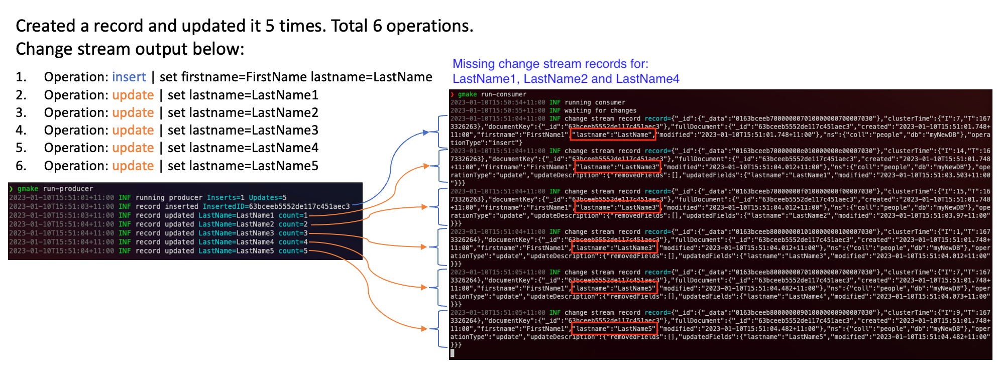

# DocumentDB ChangeStream Issue Repro

This repo contains Golang code to reproduce DocumentDB changestream issue.

## The issue

When multiple updates are performed on the same record in short period of time, changestream events fail to represent what actually happened to the record as output events do not match the actions performed on the record.

The following is a screenshot of an example run, missing events for updates `LastName1`, `LastName2` and `LastName4`.



## Running the repro 

Pre-requisites:

- Golang 1.18 or higher
- curl
- make
- A DocumentDB instance
  - database name: `myNewDB`
  - collection name: `people`
  - change stream enabled on the DB for all collections

To run the code,
- Replace the connection string in the `Makefile`
  ```text
    --connection-string "mongodb://<user>:<password>@<host>:27017/?ssl=true&sslInsecure=true&ssl_ca_certs=rds-combined-ca-bundle.pem&replicaSet=rs0&readPreference=secondaryPreferred&retryWrites=false"
  ```
- Run the consumer `make run-consumer` - consumer watches the change-stream and prints out events to the console as they come in.
- Run the producer `make run-producer` - producer inserts and updates records in a DocumentDB collection.

## Demo


